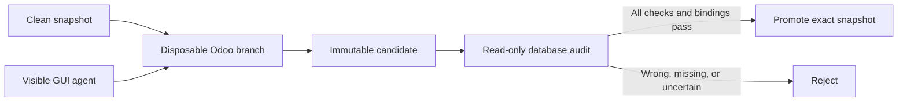

# Forklift: transactional computer use for Odoo

> **An agent's “done” is a proposal, not a commit.** Forklift performs visible
> Odoo work on disposable state, freezes the result, and promotes only the exact
> snapshot whose database passes a separate read-only audit.

## Review in 60 seconds



The archived sealed campaign exercised six hidden positions and preserved every
attempt:

| Trial | Forklift decision | Database proof |
|---|---|---|
| Clean zero, partial, and full receipt flows | accepted | every applicable purchase, receipt, bill, tax, payable, and payment invariant passed |
| One-cent wrong unit price | rejected | `po-unit_price` failed |
| Worker killed after receipt | rejected | downstream `bill-count` failed |
| Duplicate payment submission | accepted | exactly one valid reconciled payment existed |

**Result: 6/6 positions, 0 invalid states accepted.** This result belongs to
the exact historical oracle-v1 source archived with the evidence—not to the
newer oracle-v2 working tree. See the [result matrix](docs/final-results.md), or
verify the packet offline:

```bash
python -m scripts.verify_final_evidence
```

For a focused code review, follow the acceptance boundary in this order:

1. [`gui_worker.py`](forklift/gui_worker.py) — performs the untrusted visible work;
2. [`orchestrator.py`](forklift/orchestrator.py) — creates, freezes, and audits candidates;
3. [`odoo_sql.py`](forklift/odoo_sql.py) and [`oracle.py`](forklift/oracle.py) — prove business state through a read-only database role;
4. [`promotion.py`](forklift/promotion.py) — binds approval to the exact audited snapshot; and
5. [`verify_final_evidence.py`](scripts/verify_final_evidence.py) — verifies the historical sealed packet and its retry rules.

## What Forklift demonstrates

Forklift adds a transaction-like acceptance boundary to stateful GUI
automation. A visible browser worker performs a real purchase-to-pay workflow
in Odoo on a disposable state branch. Forklift then freezes that branch, audits
the exact frozen state from a fresh sandbox, and promotes it only when every
business invariant passes. Failed or uncertain work never replaces the clean
canonical state.

The reusable pattern is: isolate GUI work, distrust its completion signal,
validate business semantics from immutable state, and bind promotion to the
exact snapshot that was audited. The scenario deliberately includes partial
receipts, duplicate actions, wrong values, timeouts, and worker crashes.

> [!IMPORTANT]
> **Evidence scope:** the working implementation is a post-campaign,
> security-hardened oracle-v2 reference candidate. Its unit tests and offline
> integrity checks pass, but it has not been run through a new sealed Solari
> campaign. The committed `artifacts/sealed/final-v2/` packet validates only
> the archived oracle-v1 source bytes it contains. Run and seal a fresh
> campaign before making a production assurance claim about the current code.

> [!IMPORTANT]
> Forklift's rollback boundary is the snapshotted VM. It does not undo effects
> that have already escaped that boundary, such as bank transfers, emails, or
> calls to third-party services. Keep those effects staged until after a state
> has been accepted, or protect them with a separate commit protocol.

## Try the local crash challenge

Prerequisites:

- Python 3.11 or newer
- Docker with the Compose plugin

From this directory, run:

```bash
python -m pip install --require-hashes -r requirements.txt
python -m scripts.setup_local_lab
```

No Solari account or API key is required. The first Odoo initialization can
take several minutes. A successful run ends with one incomplete database
rejected, one balanced database accepted, and `RESULT: PASS`.

The setup is fail-closed: it reuses an already-correct lab, but refuses to
overwrite an ambiguous or non-clean canonical database. It generates strong
local Odoo, database-owner, and read-only-auditor passwords in the ignored
`.env` file when they are absent. Both published container ports bind to
`127.0.0.1` only.

Open <http://localhost:8069> to inspect the local Odoo instance. The lab login
is `admin` with the `FORKLIFT_ADMIN_PASSWORD` value from your local `.env`.

To rerun only the interrupted-versus-valid comparison:

```bash
python -m scripts.compare_live_states
```

To stop the local services:

```bash
docker compose down
```

To remove the retained synthetic databases and generated Odoo data as well:

```bash
docker compose down -v
```

## How acceptance works

```text
clean snapshot
      |
      v
disposable Odoo branch <-- visible GUI worker
      |
      v
immutable candidate snapshot --> separate read-only auditor process
      |
      +-- all invariants + lineage + receipt pass --> durable template
      |
      `-- missing, invalid, or uncertain evidence ---> no promotion
```

The auditor never inspects the worker's still-changing VM. It starts from the
candidate snapshot, receives a host-supplied oracle bundle after sealing, and
queries PostgreSQL through a SELECT-only role. The selector requires the exact
check-code schema, the canonical auditor runtime fingerprint, the host bundle
fingerprint, input and action digests, canonical lineage, and a receipt bound to
the full verdict and candidate snapshot. This ordering prevents a
check-then-change race: the snapshot inspected is the snapshot eligible for
promotion.

> [!CAUTION]
> A Solari snapshot contains both the database and its execution substrate. A
> separate process forked from that snapshot therefore inherits its Python,
> PostgreSQL, libraries, and operating system. The current mechanism protects
> against fallible GUI behavior that cannot alter that substrate; it is not a
> proof against a deliberately compromised candidate runtime. That stronger
> claim requires a pristine auditor image with point-in-time candidate data
> mounted read-only, or equivalent provider-backed attestation. See
> [Architecture](docs/architecture.md#hostile-runtime-boundary).

The current oracle requires, as applicable:

1. exactly one purchase order with the expected supplier, product, quantities,
   price, currency, and taxes;
2. the correct completed receipt and no unintended stock moves;
3. exactly one correctly linked and posted vendor bill;
4. balanced journal entries, expected tax lines, and the correct payable;
5. exactly one correctly reconciled payment when payment is allowed; and
6. a complete execution receipt with exact input, fault, lineage, and snapshot
   bindings.

The current version also censuses the base purchase-order, picking, vendor-bill,
and payment tables before joining details, so empty or malformed objects cannot
disappear through an inner join. Any missing relation, duplicate object, wrong
value, oracle error, schema mismatch, or incomplete receipt is a rejection.

## Verify the historical oracle-v1 evidence

The archived frozen campaign completed all six held-out positions with **zero
invalid states accepted** under oracle v1. Four valid states were accepted, two
invalid states were refused, and all eight attempts were retained. The two
extra attempts were Chrome failures before login and before any business
mutation; no post-mutation attempt was retried. This result is evidence for the
archived source bundle, not the current oracle-v2 implementation.

The evidence verifier works offline and does not require a Solari key:

```bash
python -m scripts.verify_final_evidence
```

Run the unit test suite with:

```bash
python -m unittest discover -v
```

It recomputes the case generation, protocol and report digests, archived frozen
source and dependency hashes, attempt hashes, retry rules, and acceptance
outcomes. Add `--require-frozen-runtime` to also require the historical package
environment; the default verifier intentionally permits the current patched
environment while still hashing the exact source bytes used by the campaign.
A successful default verification means the historical packet is internally
consistent; it does not mean the current runtime matches that packet. The
archived result is adversarial verification from the original implementation
environment, not an independent replication.

For the result matrix and a short guided review, see
[final-results.md](docs/final-results.md) and
[evidence-walkthrough.md](docs/evidence-walkthrough.md).

## Run against Solari

The exact orchestration, adapter, worker, audit, and evidence-generation source
used for the historical live campaign is preserved inside
`artifacts/sealed/final-v2/frozen-source.tar.gz`. The working files are the
post-campaign oracle-v2 candidate and are intentionally different. To run new
Solari trials, copy `.env.example` to `.env`, supply your own `SOLARI_API_KEY`,
and rebuild the canonical Odoo runtime and database artifacts with the scripts
in `scripts/`. Run `python -m scripts.setup_local_lab` first to generate the
required local credentials.

> [!WARNING]
> Live campaign scripts create Solari sandboxes, desktops, snapshots, and
> templates and can consume billable account resources. Review their CPU,
> memory, disk, and timeout settings before running them, and confirm cleanup in
> the Solari console after an interrupted run.

> [!NOTE]
> The live-campaign adapter targets the pinned Solari Python SDK 0.2.0. It
> isolates a small compatibility layer that uses the SDK's private `_hooks` and
> `_request` members because the required desktop-from-snapshot and promotion
> operations were not exposed by the typed client in that version. Treat the
> live path as a version-pinned reference implementation and review
> `forklift/solari_adapter.py` when upgrading the SDK. The local lab and offline
> evidence verifier do not use these private paths.

`requirements.in` records the constrained inputs. `requirements.txt` is a
universal, hash-locked resolution generated with `uv pip compile`; install it
with `--require-hashes`. The Compose file pins the PostgreSQL and Odoo manifest
digests rather than mutable tags. The disposable browser worker likewise
installs only wheels allowed by `remote-browser-requirements.txt` and verifies
every package hash.

The committed evidence intentionally excludes temporary signed URLs, local
credentials, and bulky development artifacts. Raw receipts retain Solari
resource IDs because they are part of the snapshot-lineage bindings; no API
keys or signed preview/control URLs are included. These omissions do not affect
offline verification of the published result.

## Adapt the pattern

The Odoo implementation is an example, not a universal transaction layer. To
adapt it to another workflow:

- replace `forklift/gui_worker.py` with the visible-computer task;
- model the expected outcome in `forklift/domain.py`;
- replace `forklift/odoo_sql.py` and `forklift/oracle.py` with read-only,
  domain-specific checks;
- keep the snapshot-lineage and receipt checks in `forklift/promotion.py`; and
- add both valid controls and realistic fault cases before relying on the gate.

If the workflow can trigger external effects, design their commit boundary
explicitly rather than assuming a VM snapshot can reverse them.

## Documentation

- [Architecture](docs/architecture.md)
- [Design rationale](docs/design-rationale.md)
- [Validation protocol](docs/validation-protocol.md)
- [Final results](docs/final-results.md)
- [Development results](docs/development-results.md)
- [Evidence walkthrough](docs/evidence-walkthrough.md)
- [Validation receipt](docs/validation-receipt.md)
- [Observed failure mode](docs/failure-mode.md)

The example is covered by the repository's MIT license.
